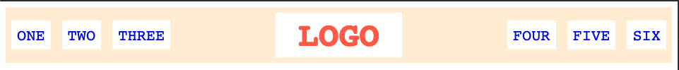

# A Basic Header

## Desired Outcome

narrow:

wide: 

### Requirments
- There is space between all items and the edge of the header (specific px amount doesn't matter here)
- Logo is centered vertically and horizontally.
- list-items are horizontal, and are centered vertically inside the header
- left-links and right-links are pushed all the way to the left and right, and stay at the edge of the header when the page is resized.
- This exercise does not use floats, inline-block, or absolute positioning.