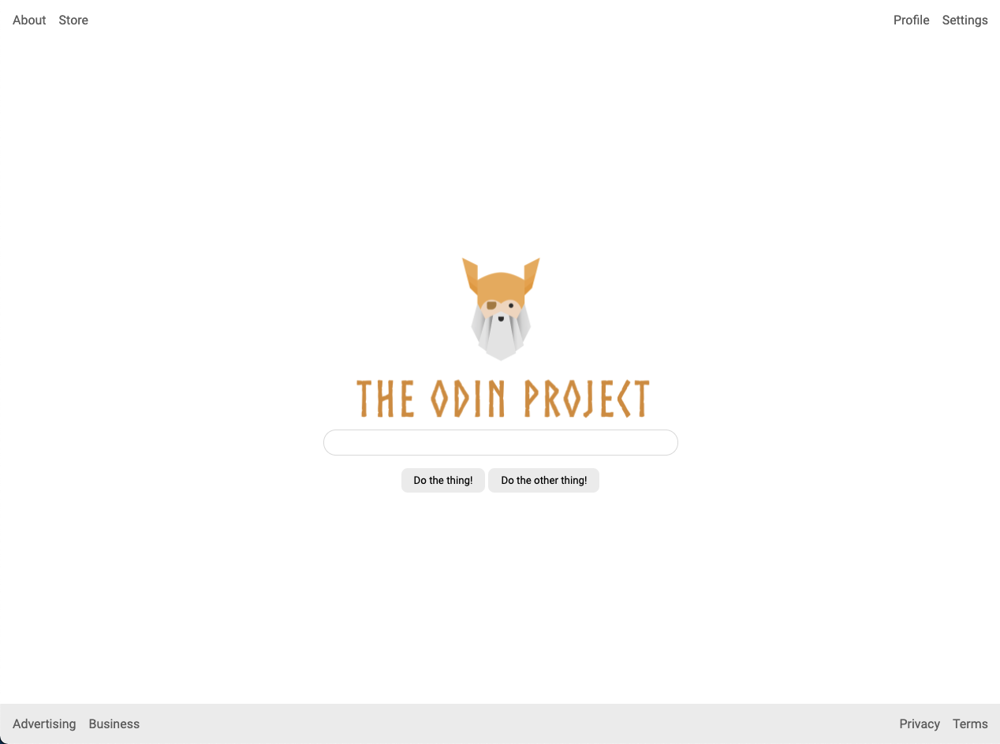

# An entire page!

## Desired Outcome

### Requirments

- Header is at the top of the page, footer is at the bottom and they stay in place if you resize your screen.  
- Header and footer have padding.
- Links in header and footer are pushed to either side.
- There is space between the links in the header and footer.
- Footer has a light gray background (`#eeeeee`).
- Logo, input and buttons are centered in the screen.
- Buttons have an appropriate amount of padding.
- There is space between the logo, input and buttons.

#### Learning outcomes